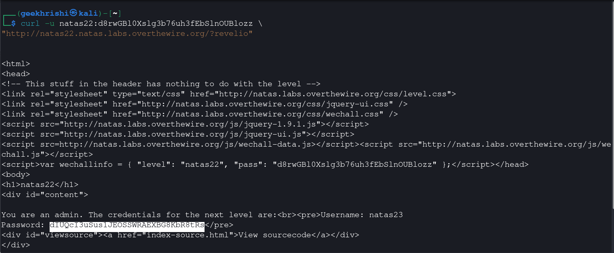

# Natas Level 22 → 23

**Vulnerability:** Authentication Bypass via Client-Side Redirect Trust
**Difficulty:** Hard
**Tools Used:** Browser, curl, Source Code Review
**OWASP Category:** A01 Broken Access Control
**Attack Class:** Logic Flaw

---

### What the level gives you

The application contains almost no visible functionality. Source code is available, revealing a hidden parameter named `revelio`.

A redirect appears to occur whenever this parameter is supplied.

---

### Vulnerability theory

HTTP redirects are implemented using response headers. A common developer mistake is assuming that once a redirect header is issued, execution automatically terminates.

In PHP, however, execution continues unless explicitly stopped using `exit()` or `die()`.

As a result, sensitive functionality located after a redirect statement may still execute and produce output. Browsers follow the redirect automatically and hide the response body, but command-line tools and intercepting proxies can still access it.

The attack primitive provided is forced disclosure of server-generated content despite attempted redirection.

---

### Source code analysis

Relevant source:

```php
if(array_key_exists("revelio", $_GET)) {

    if(!($_SESSION &&
         array_key_exists("admin", $_SESSION) &&
         $_SESSION["admin"] == 1)) {

        header("Location: /");
    }
}
```

Credential disclosure:

```php
if(array_key_exists("revelio", $_GET)) {

    print "You are an admin.";
    print "Username: natas23";
    print "Password: <censored>";
}
```

Problem:

```php
header("Location: /");
```

Missing:

```php
exit();
```

Execution continues after sending the redirect.

The developer incorrectly assumed the redirect would terminate processing.

---

### Approach

Reviewing the source code immediately revealed the hidden `revelio` parameter. The redirect logic appeared intended to block unauthorized users.

However, there was no `exit()` statement after the redirect header. This suggested that the application would continue generating output even after instructing the browser to navigate elsewhere.

Testing through a browser did not reveal credentials because the redirect was followed automatically. To observe the raw response body, I used curl and requested the page directly.

The response contained the credential disclosure despite the redirect.

---

### Exploitation

```bash
curl -u natas22:CURRENT_PASSWORD \
"http://natas22.natas.labs.overthewire.org/?revelio"
```

Response:

```html
You are an admin.
The credentials for the next level are:

Username: natas23
Password: dIUQcI3uSus1JEOSSWRAEXBG8KbR8tRs
```

---

### Screenshot



---

### Real-world relevance

This vulnerability is a classic access-control logic flaw and maps to OWASP A01 Broken Access Control. Similar issues appear when applications attempt to enforce authorization using redirects rather than server-side access controls.

VAPT reports frequently identify endpoints where redirects hide content from browsers but do not prevent backend execution. Attackers using Burp Suite, curl, or automated scanners can access protected content directly.

---

### Defender's perspective

Every redirect that enforces security decisions should immediately terminate execution using `exit()` or `die()`. Authorization checks should occur before sensitive content generation.

Security testing should verify response bodies, not just browser behavior. SOC monitoring can identify repeated requests targeting hidden parameters associated with administrative functionality.

---

### What I'd do differently

A proxy such as Burp Suite could have been used to inspect the raw HTTP response directly rather than relying on curl.