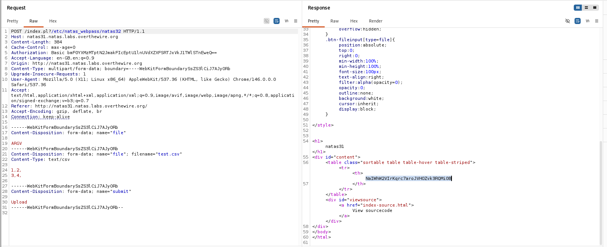

# Natas Level 31 → 32

**Vulnerability:** Perl CGI Argument Injection via Multipart Parameter Pollution
**Difficulty:** Hard
**Tools Used:** Browser, Burp Suite Repeater, Source Code Review
**OWASP Category:** A03:2021 – Injection
**Attack Class:** Argument Injection

---

## What the level gives you

The application allows users to upload CSV files and converts them into an HTML table. Source code is provided, showing how uploaded files are processed using Perl CGI.

At first glance the application appears secure because all rendered output is passed through `escapeHTML()`, preventing direct HTML or JavaScript injection.

The objective is to abuse the file upload handling logic and retrieve the password for the next level.

---

## Vulnerability theory

This challenge demonstrates argument injection through Perl CGI parameter handling.

Perl CGI permits multiple values to be supplied under the same parameter name. If application logic assumes a parameter contains only a single uploaded file, attackers can supply additional values that alter how the backend processes the request.

The vulnerability exists because the application retrieves the uploaded file using `param('file')` without validating that the returned value is a legitimate uploaded file handle.

This creates an argument injection primitive that can be abused to access arbitrary files and ultimately disclose sensitive information.

---

## Source code analysis

```perl
my $cgi = CGI->new;

if ($cgi->upload('file')) {

    my $file = $cgi->param('file');

    while (<$file>) {

        my @elements = split /,/, $_;

        foreach(@elements){
            print "<td>".$cgi->escapeHTML($_)."</td>";
        }
    }
}
```

### Vulnerable Logic

```perl
my $file = $cgi->param('file');
```

The developer assumes that `param('file')` always returns a valid uploaded file.

However, Perl CGI allows multiple values to be supplied for the same parameter. An attacker can therefore inject additional values alongside the legitimate upload.

Later:

```perl
while (<$file>)
```

The application blindly trusts the returned value and processes it as a file handle.

The vulnerability arises because parameter type and origin are never validated before use.

---

## Approach

The source code showed that uploaded files were handled through the `file` parameter and rendered into an HTML table.

Because the output was escaped, I ruled out client-side attacks and focused on how Perl CGI handled uploaded parameters internally.

The key observation was that the application used `param('file')` rather than strictly relying on the uploaded file handle returned by `upload('file')`.

I began testing multipart requests in Burp Repeater and discovered that multiple values could be supplied for the same parameter. Once I confirmed this behavior, I modified the request to inject an additional argument alongside a legitimate CSV upload.

The manipulated request caused the backend to access sensitive files and return the password for the next level.

---

## Exploitation

I intercepted the upload request using Burp Suite Repeater and modified the multipart body.

A normal upload contained:

```http
Content-Disposition: form-data; name="file"; filename="test.csv"
Content-Type: text/csv

1,2
3,4
```

I then supplied an additional value under the same parameter name:

```http
Content-Disposition: form-data; name="file"

ARGV
```

The final request was modified so that the injected argument referenced:

```text
/etc/natas_webpass/natas32
```

After forwarding the request through Burp Repeater, the application processed the injected argument and disclosed the contents of the password file.

### Password Retrieved

```text
NaIWhW2VIrKqrc7aroJVHOZvk3RQMi0B
```

---

## Screenshot

### Burp Repeater Request Manipulation & Password Disclosure



---

## Real-world relevance

This vulnerability falls under OWASP A03:2021 – Injection. Argument injection flaws frequently appear in file-processing systems, backup software, antivirus integrations, and document conversion services.

Unlike classic command injection, argument injection abuses how applications pass user-controlled values into trusted APIs or executables. Because the attack does not always require shell metacharacters, it can bypass simplistic input validation and filtering.

In professional penetration testing engagements, argument injection findings are typically rated High or Critical because they often lead directly to arbitrary file access or code execution.

---

## Defender's perspective

Uploaded files should only be processed through trusted file handles returned by upload-specific APIs.

Applications must validate both the type and origin of uploaded parameters before processing them. Framework-level protections should reject duplicate multipart parameters unless explicitly required.

From a detection perspective, repeated multipart parameter names and unexpected upload structures should be treated as indicators of malicious activity.

---

## What I'd do differently

I would automate multipart request mutation using Burp Intruder to systematically identify parameter pollution opportunities rather than testing them manually.
