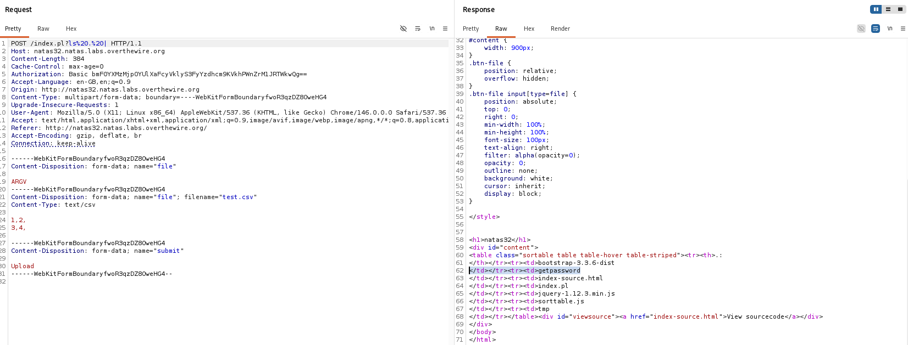
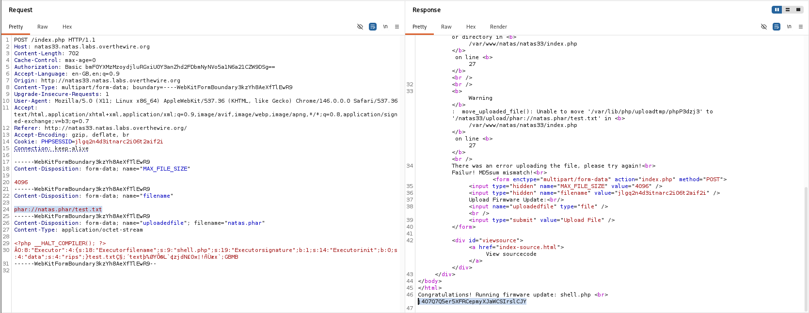

# Natas Level 32 → 33

**Vulnerability:** Perl CGI Argument Injection Leading to Arbitrary Binary Execution
**Difficulty:** Hard
**Tools Used:** Browser, Burp Suite Repeater, Source Code Review
**OWASP Category:** A03:2021 – Injection
**Attack Class:** Argument Injection / Code Execution

---

## What the level gives you

The application is nearly identical to the previous level. Users upload CSV files which are rendered as sortable HTML tables.

The source code is effectively unchanged, but the challenge introduces a new requirement: instead of reading a password file directly, the user must demonstrate code execution by running a binary located in the web root.

The objective is to execute the provided binary and retrieve the credentials for the next level.

---

## Vulnerability theory

The underlying vulnerability is identical to Natas31. The application trusts values returned by Perl CGI's parameter handling functions and assumes uploaded file parameters always represent legitimate file handles.

By supplying attacker-controlled values through multipart parameter pollution, it becomes possible to influence how the backend processes uploaded files.

Once arbitrary argument injection is achieved, attackers can move beyond file disclosure and execute local binaries available to the application.

This transforms a file-processing vulnerability into an operating system command execution primitive.

---

## Source code analysis

```perl
my $cgi = CGI->new;

if ($cgi->upload('file')) {

    my $file = $cgi->param('file');

    while (<$file>) {

        my @elements = split /,/, $_;

        foreach(@elements){
            print "<td>".$cgi->escapeHTML($_)."</td>";
        }
    }
}
```

The vulnerable logic remains:

```perl
my $file = $cgi->param('file');
```

User-controlled values are accepted without validating whether they originate from a genuine uploaded file.

Because Perl CGI permits multiple values for the same parameter, an attacker can inject arguments that influence how the backend processes requests.

---

## Approach

Since the source code was almost identical to Natas31, I reused the same argument injection technique.

The challenge specifically stated that code execution had to be demonstrated through a binary present in the web root. Rather than immediately attempting to retrieve the password, I first enumerated available files.

Using Burp Repeater, I modified the request to list the contents of the current directory and identified a binary named `getpassword`.

Once the binary was discovered, I modified the payload to execute it directly. The binary returned the password for the next level.

---

## Exploitation

### Stage 1 – Enumerate Available Files

The request was modified to execute:

```text
?ls . |
```

The response revealed:

```text
bootstrap-3.3.6-dist
getpassword
index-source.html
index.pl
jquery-1.12.3.min.js
sortable.js
tmp
```

### Stage 2 – Execute the Binary

After identifying the binary, the payload was changed to:

```text
?./getpassword
```

The application executed the binary and returned the next level password.

### Password Retrieved

```text
2v9nDlbSF7jvawaCncr5Z9kSzkmBeoCJ
```

---

## Screenshot

### Enumeration of Web Root Files



### Successful Binary Execution



---

## Real-world relevance

This vulnerability maps directly to OWASP A03:2021 – Injection. Argument injection vulnerabilities frequently escalate into full remote code execution when attackers gain access to trusted local binaries.

Real-world examples include vulnerabilities affecting backup systems, antivirus software, orchestration frameworks, and file conversion services. Attackers often chain argument injection with existing executables to bypass restrictions and achieve complete system compromise.

In penetration testing reports, vulnerabilities that permit arbitrary binary execution are generally classified as Critical due to their impact.

---

## Defender's perspective

Applications should never allow user-controlled data to influence executable paths or command arguments.

Developers should avoid invoking external programs when native APIs are available and should strictly validate all upload-related parameters before processing them.

Framework-level controls should reject duplicate multipart parameters and enforce strict type validation. From a SOC perspective, monitoring for web-server-spawned child processes can provide strong detection coverage for this class of attack.

---

## What I'd do differently

Once command execution was established, I would automate enumeration of available binaries and files to reduce manual interaction and speed up exploitation.
