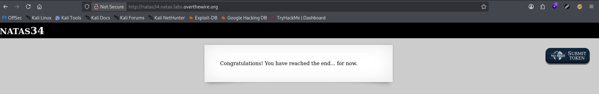

# Natas Level 33 → 34 (Final Completion)

## Overview

Natas34 is the final level in the Natas wargame.

After obtaining the Natas34 credentials from the previous challenge and successfully authenticating via HTTP Basic Authentication, the application displays a completion message indicating that the player has reached the end of the currently available Natas levels.

Unlike previous levels, Natas34 does not contain an additional challenge, source code, vulnerability, or password to recover. Its purpose is to serve as the completion point for the wargame.

---

## Verification

Using the credentials obtained from Natas33, I authenticated to the Natas34 application.

The server returned the following message:

```text
Congratulations! You have reached the end... for now.
```

This confirms successful completion of the Natas challenge series and verifies that the credentials obtained from the previous level were valid.

---

## Screenshot

### Final Challenge Completion



---

## Final Status

* Levels Completed: 34/34
* Final Level Reached: Natas34
* Status: Complete

---

## Key Takeaways

The Natas wargame covers a broad range of web application security concepts, including:

* Information Disclosure
* Broken Access Control
* HTTP Header Manipulation
* Session Management Weaknesses
* Source Code Review
* Directory Traversal
* Command Injection
* SQL Injection
* Blind SQL Injection
* File Inclusion Vulnerabilities
* File Upload Vulnerabilities
* Session Manipulation
* Cryptographic Weaknesses
* Type Juggling and Type Confusion
* Deserialization Vulnerabilities
* Argument Injection
* Log Poisoning
* Authentication and Authorization Bypass

Completing the entire series provides hands-on experience identifying, analyzing, and exploiting common web application vulnerabilities in a controlled environment. The progression from simple information disclosure issues to advanced exploitation techniques such as deserialization, cryptographic manipulation, and file upload abuse mirrors the methodology used during real-world web application penetration tests.

The Natas wargame serves as an excellent foundation for web application security, vulnerability assessment, secure coding review, and OWASP Top 10 concepts.
